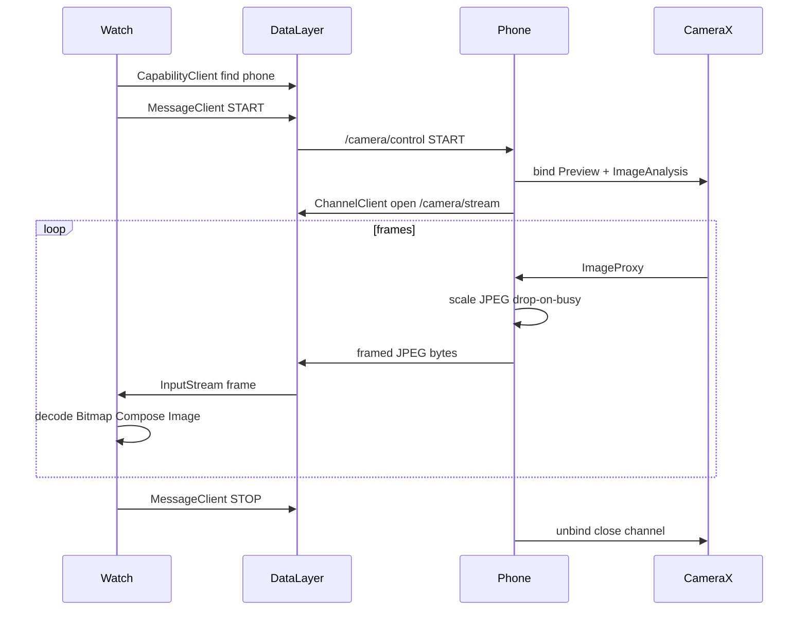

# CameraWatch: Phone Camera → Galaxy Watch 4

> Saved copy of the implementation plan used for this project  
> (source: `.cursor/plans/camera_watch_stream_c1c9e251.plan.md`).

**Overview:** Build a phone+Wear companion app on the existing CameraWatch scaffold: CameraX captures frames on the phone, Wear Data Layer streams compressed JPEGs to the Galaxy Watch 4, and Wear Compose renders a live preview at a Bluetooth-friendly frame rate.

## Todos (completed)

- [x] Add `:shared` library with WearPaths, capabilities, FrameProtocol; wire settings + both apps
- [x] Add CameraX + wearable deps, CAMERA permission, wear.xml capabilities, set wear standalone=false
- [x] Implement CameraX Preview + ImageAnalysis encoder with drop-on-busy JPEG pipeline
- [x] Implement PhoneWearBridge: capability, MessageClient START/STOP, ChannelClient frame sender
- [x] Implement WatchWearBridge + FrameStreamReceiver and Compose CameraFeedScreen
- [x] Validate end-to-end on phone + Galaxy Watch 4 (discovery, stream, stop, lifecycle)

## Goal

Turn the existing empty dual-module scaffold into a **companion pair**: the phone runs the camera; the Galaxy Watch 4 (Wear OS) shows a **live preview** (~5–8 fps). Control starts from the watch; the phone also shows a local camera preview and connection status.

## Current baseline (at plan time)

- Modules already exist: `:app` (phone) + `:wear` (watch), both Compose, package `ro.adrianus.camerawatch`
- Wear already has `play-services-wearable`; phone does **not**
- No camera code, no Data Layer usage, wear marked `standalone=true` in `wear/.../AndroidManifest.xml`

## Architecture



**Transport choice (fixed):** Wearable Data Layer only — no raw Bluetooth/Wi‑Fi sockets.

| Concern | API |
|---------|-----|
| Discovery | `CapabilityClient` + `res/values/wear.xml` |
| Control (START/STOP) | `MessageClient` |
| Live frames | `ChannelClient` + length-prefixed JPEG protocol |
| Camera | CameraX `Preview` + `ImageAnalysis` (`STRATEGY_KEEP_ONLY_LATEST`) |
| Watch UI | Wear Compose `Image` |

**Performance budget for Watch 4:** longest edge **~320–360 px**, JPEG quality **~50**, **5–8 fps**, drop frames if encode/send is busy. Expect ~8–25 KB/frame over Bluetooth.

## Module layout

```
CameraWatch/
├── shared/   # paths, capability names, frame header protocol
├── app/      # camera + sender
└── wear/     # receiver + UI
```

### `:shared` (new)

- `WearPaths` — `/camera/control`, `/camera/stream`
- `WearCapabilities` — `camera_stream_phone`, `camera_stream_watch`
- `FrameProtocol` — header: magic + length + seq + timestampMs, then JPEG bytes
- Gradle: `com.android.library`, included from `settings.gradle.kts`

### `:app` (phone)

Key packages under `ro.adrianus.camerawatch`:

- `camera/CameraPreviewController` — CameraX bind/unbind, permission gate
- `camera/FrameEncoder` — scale → JPEG on background executor
- `wear/PhoneWearBridge` — capability advertise, MessageClient listener, open ChannelClient to watch
- `wear/FrameStreamSender` — write framed JPEGs; never queue (drop if busy)
- `MainActivity` — Compose: permission UI, `PreviewView` (or Compose interop), streaming status, “waiting for watch” state
- Optional `CameraStreamService` foreground service if streaming must survive brief Activity pauses (v1 can keep streaming tied to Activity lifecycle first)

**Manifest / deps:** `CAMERA` permission; `play-services-wearable`; CameraX (`camera-camera2`, `camera-lifecycle`, `camera-view`); `wear.xml` capability `camera_stream_phone`.

### `:wear` (watch)

- `presentation/CameraFeedScreen` — full-screen latest bitmap, Start/Stop, connection status
- `wear/WatchWearBridge` — find phone via capability, send START/STOP
- `wear/FrameStreamReceiver` — read framed stream off main thread; update `StateFlow`
- Set `com.google.android.wearable.standalone` to **`false`** (phone required)
- Keep screen on while streaming; stop stream in `ON_STOP`

**Manifest / deps:** already has wearable Play Services; add `wear.xml` capability `camera_stream_watch`; depend on `:shared`.

## Implementation phases

### 1. Project wiring

- Create `:shared`, update version catalog (`gradle/libs.versions.toml`) with CameraX + ensure wearable on both apps
- Add `res/values/wear.xml` capability arrays to both modules
- Flip wear standalone meta-data to `false`

### 2. Shared protocol + discovery

- Implement capability constants and frame header read/write
- Phone and watch advertise capabilities; watch resolves reachable phone node before START

### 3. Phone camera pipeline

- Request runtime camera permission
- Bind CameraX Preview (local UI) + ImageAnalysis at modest analyze size (e.g. 640×480)
- Encode: scale ≤360 edge, JPEG q≈50; close every `ImageProxy`; drop if previous send unfinished

### 4. Streaming bridge

- On START message: open channel to watch node, start analysis → sender
- On STOP / disconnect / Activity destroy: close channel, unbind camera
- Message paths only for small control payloads (never send JPEG via MessageClient)

### 5. Watch UI

- Replace Hello World in `wear/.../MainActivity.kt` with feed screen
- Decode JPEG off main thread
- Show clear states: no phone, connecting, streaming, error

### 6. Manual validation (Galaxy Watch 4 + phone)

- Both apps installed; watch paired via Galaxy Wearable / Wear OS
- Open watch app → Start → phone grants camera → watch shows live frames
- Confirm ~5–8 fps, lag under ~1–2 s, clean Stop, no camera stall after leave screen

## Out of scope for v1

Recording on watch, H.264, Wi‑Fi Direct, multi-watch, Play Store packaging polish, still-photo capture mode.

## Key risks

- Bluetooth bandwidth: too high resolution/FPS causes multi-second lag — mitigated by aggressive downscale + drop-on-busy
- Missing `wear.xml` capabilities → empty node discovery despite paired devices
- Same `applicationId` on both modules is already in the scaffold and is fine for companion install; leave as-is

## Post-plan note

The original plan suggested recycling previous bitmaps after swap on the watch. That caused a fatal crash (`Canvas: trying to use a recycled bitmap`) because Compose’s `asImageBitmap()` still referenced the buffer. The implemented fix is to **not** recycle bitmaps while they may be drawn; rely on GC instead.
