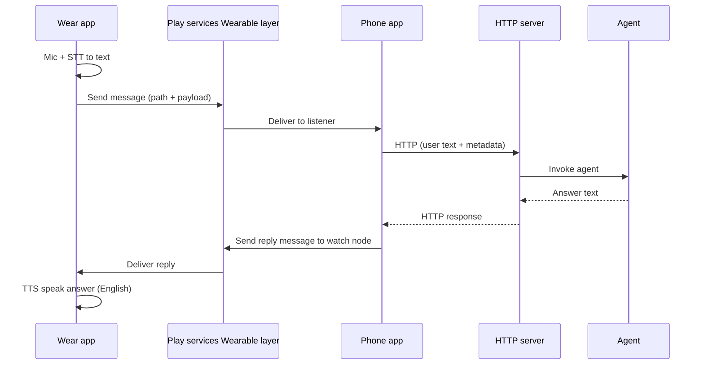

# VoiceBridge — Implementation Plan

This document captures the end-to-end architecture, product decisions, and phased implementation plan for the VoiceBridge Android project (Wear OS companion + phone app). The server lives in a **separate repository**; this repo stays **Android-only**.

---

## Target architecture

User speaks on the watch; speech is turned into text on the watch; text is sent to the phone over Google Play services (paired Bluetooth); the phone performs a single HTTP request to a backend; the backend will eventually invoke an agent and return an answer; the answer returns to the phone, then to the watch; the watch speaks the answer (English TTS).

### Component responsibilities

| Component | Responsibility |
|-----------|----------------|
| **Wear app** | Capture speech (STT), send text to phone via Wearable Message API, receive reply, play TTS (English). **No direct HTTP to the server.** |
| **Play services (Wearable)** | Routes messages between paired watch and phone when the companion model is satisfied. |
| **Phone app** | Receives messages from the watch, performs **all** HTTP calls to the backend, sends structured replies back to the watch. Relays in **foreground** for the initial implementation. |
| **HTTP server** | Own repo; not implemented yet. Android uses a **placeholder** base URL and a documented request/response shape until the real server exists. |
| **Agent** | Invoked by the server; returns answer text (English). Integration is server-side only from this plan’s perspective. |

---

## Connectivity and transport

- **Watch ↔ phone:** Works when the watch is **paired to the phone via Bluetooth** (companion path). Use **`play-services-wearable`** (already a dependency in both modules).
- **Default transport:** **Wearable Message API** (`MessageClient`) with a small **JSON envelope** and dedicated **paths** (e.g. under `/voicebridge/...`). Fits request/response for Phase 0.
- **Alternatives (later):** **DataClient** for heavier state sync; **ChannelClient** for streaming chunks in Phase 1 if Message API limits or UX require it.

---

## Product decisions (locked)

| Topic | Decision |
|-------|----------|
| Pairing | **Bluetooth-paired** companion only; no standalone LTE/Wi‑Fi server access from the watch for v1. |
| HTTP ownership | **Phone app only** performs HTTP. The **watch does not** call the server. |
| STT on Wear (v1) | **Google full-screen voice UI** via **`RecognizerIntent`**. If UX or behavior is insufficient, revisit with **`SpeechRecognizer`** + in-app Compose UI. |
| Languages | **STT:** user may speak **English or Romanian**. **Answer text and TTS:** **English only** (backend/agent returns English; TTS uses an English locale/voice on the watch). |
| Server | **Not in this repo**; separate server repo later. Android uses a **configurable placeholder** base URL until the real server is available. |
| Authentication | **API key** sent as an **HTTP header** (exact header name to be chosen at implementation time, e.g. `X-API-Key`, and used consistently). |
| HTTP behavior | **Phase 0:** **blocking** request/response. **Phase 1:** move to **streaming** (see Streaming section). |
| Phone relay | **Foreground** for Phase 0 (user-visible / Activity foreground); background reliability can be revisited if expectations change. |
| Repository scope | **Android-only**; server implementation and agent wiring live elsewhere. |
| Privacy / logging | User speech **text** may leave the device to the server/agent. Add **functional, debug-oriented logging** (phases, request ids, HTTP status, errors). **No** formal retention or auditing requirements at this stage; avoid logging secrets and avoid logging full raw user strings in production if logs are persisted (truncate or length-cap where practical). |

### Clarification: “no calls from watch”

The watch must **not** perform HTTP to the backend. Only the **phone** owns outbound HTTP.

### Clarification: TTS location

The primary flow is **TTS on the watch** in **English** so the user hears the answer on the wrist. If product requirements later demand **audio from the phone speaker**, that would move or duplicate TTS on the phone module.

---

## Project layout (this repo)

- **`mobile`** — Phone app under `ro.adrianus.voicebridge`: **`config`** (server constants), **`network`** (HTTP client), **`service`** (`WearableListenerService`); **`MainActivity`** stays in the root package as the entry UI.
- **`wear`** — Wear app: Compose UI, `RecognizerIntent`, Message send/receive, English TTS.
- **Optional `shared` module** — Shared Kotlin models and JSON serialization for message payloads so wear and mobile cannot drift.

Both apps already share the same **`applicationId`** and include **`play-services-wearable`**, which matches the companion Wear model.

---

## Message contract (implementation target)

Define stable JSON before building UI details.

### Watch → phone (query)

Suggested fields:

- `version` — schema version (integer or string).
- `requestId` — UUID for correlating reply.
- `query` — final transcript string from STT.
- `sttLocale` — BCP-47 tag reflecting recognition locale used (e.g. `en-US`, `ro-RO`).

Use a dedicated **path** such as `/voicebridge/ask` (exact naming is an implementation choice; keep paths consistent in code).

### Phone → watch (reply)

- `requestId` — must match the query.
- `answer` — English answer string from server (Phase 0).
- On failure: `errorCode` + human-readable `message` (and optionally `requestId`).

### Capability and node discovery

Use **Wearable Capability API** so the phone resolves the **correct connected watch node** when sending replies, and the watch can surface a clear state when the phone app or node is unavailable.

---

## Placeholder server contract (Android-facing)

Until the real server exists, document and implement against a **placeholder** shape that can be swapped later.

**Example (blocking Phase 0):**

- `POST {BASE_URL}/v1/ask` (path is illustrative).
- **Headers:** `Content-Type: application/json`, API key header as agreed.
- **Body:** `{ "query": "...", "requestId": "...", "sttLocale": "..." }`.
- **Response 200:** `{ "answer": "..." }` (English text).

Adjust paths and field names when the server repo defines the real API.

---

## Phase 0 — Vertical slice (blocking HTTP)

1. **Shared contract** — Optional `:shared` module with DTOs + Kotlinx Serialization or Moshi; same types for send/receive on both sides.
2. **Wear**
   - Permissions: **`RECORD_AUDIO`** (and any others required for voice input on Wear).
   - Launch **`RecognizerIntent`** full-screen STT; support **English and Romanian** input (e.g. user setting or explicit locale on the intent).
   - On final result: **`MessageClient.sendMessage`** to phone with JSON payload.
   - UI: waiting / error states; timeout messaging where helpful.
   - On reply: **`TextToSpeech`** with **English** locale for `answer`.
3. **Phone (foreground)**
   - Register for incoming messages (`VoiceBridgeListenerService` in `service`, and/or `MessageClient` listener pattern as appropriate).
   - Parse payload; **blocking HTTP** with **OkHttp** (and optionally Retrofit) with connect/read/write **timeouts**.
   - Read **base URL**, **API key**, and **mock flag** from **`ro.adrianus.voicebridge.config.VoiceBridgeServerConfig`** on the phone module (see Configuration).
   - On success: **`sendMessage`** reply to the watch **`requestId`**.
   - On failure: structured error payload back to watch.
4. **Logging** — Log `requestId`, phase transitions, HTTP status, errors; truncate or cap query logging; never log the API key.

---

## Phase 1 — Streaming

Goals: server streams answer tokens or chunks; phone forwards to watch; watch updates UX and TTS in a streaming-friendly way.

1. **Server (other repo)** — Expose streaming (e.g. **SSE** `text/event-stream` or **NDJSON/chunked** lines). Same API key header model.
2. **Phone** — Foreground **coroutine** (or structured concurrency) reads streaming body; propagates cancellation if the user dismisses the watch flow.
3. **Watch ↔ phone for chunks** — **Message API** alone may be awkward for high-frequency small payloads (limits, ordering). Prefer **ChannelClient** for a byte/text stream, or **batched** messages within documented size limits.
4. **TTS** — Buffer to **sentence or clause boundaries** before speaking where possible; avoid restarting TTS on every token unless using a streaming TTS solution later.

Phase 1 assumes Phase 0’s discovery, auth header, and English-only answer policy remain unless explicitly revised.

---

## Configuration and secrets (Android-only)

- **Base URL, API key, mock flag** — edit **`mobile/src/main/java/ro/adrianus/voicebridge/config/VoiceBridgeServerConfig.kt`** (`ro.adrianus.voicebridge.config`); no Gradle-generated `BuildConfig` for these. **Do not commit** real API keys to a public repository.

---

## Testing strategy (lightweight)

- Unit tests: JSON (de)serialization, error mapping, URL building.
- Instrumented tests where feasible: Wear/phone message round-trip is harder to automate; prioritize **contract tests** on the shared module and **HTTP** fakes on mobile.

---

## Open items (non-blocking for Phase 0)

- Exact **API key header** name (`X-API-Key` vs `Authorization: Bearer ...`).
- Romanian vs English STT selection: **settings toggle** vs **single recognizer** with broad language support vs future auto-detection.
- Release signing and how **secrets** are supplied in CI/CD when added.

---

## References (implementation hints)

- Wear OS Compose starter patterns: [android/wear-os-samples](https://github.com/android/wear-os-samples) (e.g. ComposeStarter).
- Wearable Message API, capabilities, and node IDs: [Wear OS data layer](https://developer.android.com/training/wearables/data/data-layer) documentation.

---

*Last updated from planning session: architecture, decisions, Phase 0 blocking HTTP, Phase 1 streaming, logging, and Android-only scope.*
