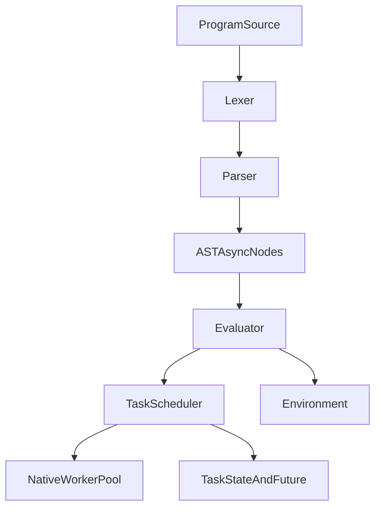

# Coroutine And Virtual Threads Plan

## Goal
Add language-level coroutines (`async fn`, `await`) and virtual-thread-like execution (many tasks multiplexed over a bounded native thread pool) in this interpreter.

## Current Baseline (Why This Plan)
- Parsing already has a dedicated async-like entrypoint pattern via `spawn(...)` in [`src/parser.cpp`](src/parser.cpp), which is the right extension seam for new coroutine syntax.
- Runtime previously exposed OS-thread handles (`Value::Kind::Thread`) in [`src/object.h`](src/object.h) and blocking `join()` in [`src/builtins.cpp`](src/builtins.cpp). Implementation replaces this with `Task` + `TaskScheduler` for M:N scheduling while keeping `join()` behavior.
- `spawnCall` is routed through the scheduler when provided from [`src/main.cpp`](src/main.cpp); a fallback path without scheduler still uses a dedicated overflow `std::thread`.

## Target Architecture

## Plan A: Implement Coroutines (`async fn` + `await`)
1. **Language surface and tokens** — [`src/token.h`](src/token.h), [`src/token.cpp`](src/token.cpp), [`src/lexer.cpp`](src/lexer.cpp).
2. **AST** — [`src/ast.h`](src/ast.h): `FunctionLiteral.is_async`, `AwaitExpression` / `AwaitExpressionExpr`.
3. **Parser** — [`src/parser.cpp`](src/parser.cpp): `async fn`, `await expr`.
4. **Runtime** — [`src/object.h`](src/object.h) / [`src/object.cpp`](src/object.cpp): `Value::Kind::Task`, `TaskObject`.
5. **Evaluator** — [`src/evaluator.cpp`](src/evaluator.cpp): async calls return `Task`; `await` blocks until result; `join` builtin aligned with `Task`.

## Plan B: Add Virtual-Thread-Like M:N Scheduling
1. **Scheduler** — [`src/scheduler.h`](src/scheduler.h), [`src/scheduler.cpp`](src/scheduler.cpp): bounded worker pool, overflow thread when submitting from a worker (avoids pool starvation on nested work).
2. **Entry** — [`src/main.cpp`](src/main.cpp): construct `TaskScheduler` and pass into `Evaluator`.

## Key Risks To Track
- AST pointer lifetime (`FunctionObject::body`) across long-lived async tasks.
- Shared mutable state races once tasks run concurrently on worker pool threads (see todo `concurrency-safety-pass`).
- Semantics mismatch between blocking `join` and `await` in nested async/sync contexts.
