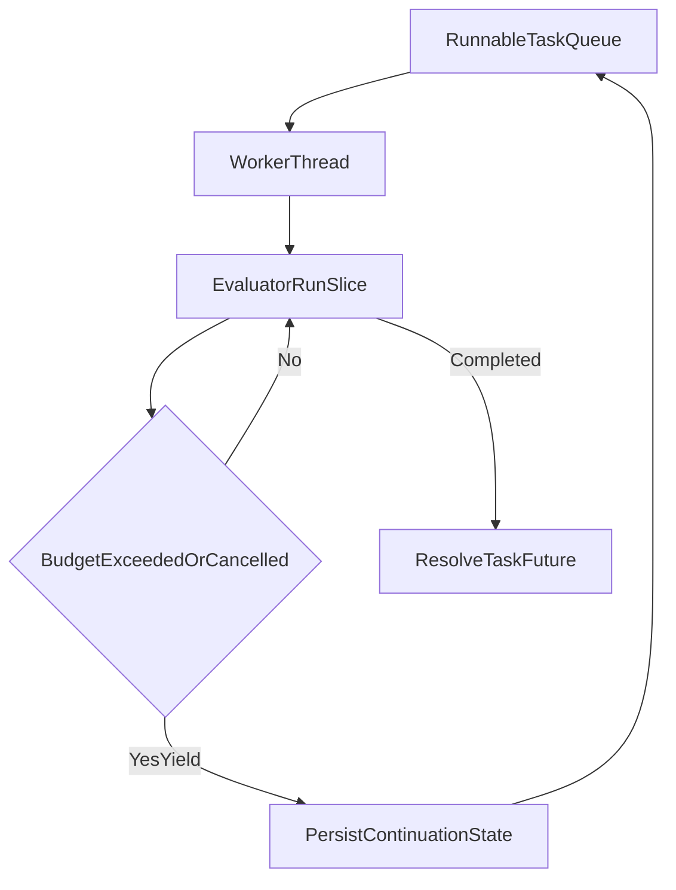

# Interpreter Preemption Plan

## Objective
Add **interpreter-level preemption** so long-running tasks no longer monopolize a worker thread, and queued tasks receive periodic execution opportunities.

## Current Baseline
- [`/Users/adrianpoplesanu/Documents/git-projects/personal-work/cursor-generated/lang3/src/scheduler.cpp`](/Users/adrianpoplesanu/Documents/git-projects/personal-work/cursor-generated/lang3/src/scheduler.cpp) runs each submitted job to completion (`job();`) on a worker thread.
- [`/Users/adrianpoplesanu/Documents/git-projects/personal-work/cursor-generated/lang3/src/evaluator.cpp`](/Users/adrianpoplesanu/Documents/git-projects/personal-work/cursor-generated/lang3/src/evaluator.cpp) evaluates recursively with no periodic interruption checks.
- `TaskObject` in [`/Users/adrianpoplesanu/Documents/git-projects/personal-work/cursor-generated/lang3/src/object.h`](/Users/adrianpoplesanu/Documents/git-projects/personal-work/cursor-generated/lang3/src/object.h) only holds `future` + join metadata, not resumable interpreter state.

## Target Model
Use **cooperative preemption checkpoints** plus scheduler quanta:
- Preemption is enforced at safe evaluator checkpoints (statement/expression boundaries), not by forcefully interrupting C++ execution.
- Scheduler grants each runnable task a budget (e.g., N checkpoints or time quantum).
- On budget exhaustion, evaluator yields a continuation frame/state back to scheduler queue.

## Phase 1: Introduce Resumable Task Abstractions
1. Extend task/runtime model in [`/Users/adrianpoplesanu/Documents/git-projects/personal-work/cursor-generated/lang3/src/object.h`](/Users/adrianpoplesanu/Documents/git-projects/personal-work/cursor-generated/lang3/src/object.h):
   - `TaskStatus` (`Ready`, `Running`, `Blocked`, `Completed`, `Failed`, `Cancelled`).
   - preemption metadata (`remaining_budget`, `last_run_timestamp`, `yield_count`).
   - continuation holder (`ExecutionFrame`/`ContinuationState` pointer).
2. Add dedicated scheduler task record type (new `scheduler_task.h/.cpp` or inside `scheduler.*`) to decouple public `TaskObject` from internal queues.

## Phase 2: Evaluator Checkpoints and Slice API
1. Refactor evaluator entry from run-to-completion into sliceable execution:
   - New API idea in [`/Users/adrianpoplesanu/Documents/git-projects/personal-work/cursor-generated/lang3/src/evaluator.h`](/Users/adrianpoplesanu/Documents/git-projects/personal-work/cursor-generated/lang3/src/evaluator.h): `RunSliceResult runSlice(TaskExecutionContext&, int budget)`.
2. Add checkpoint calls in high-frequency execution paths in [`/Users/adrianpoplesanu/Documents/git-projects/personal-work/cursor-generated/lang3/src/evaluator.cpp`](/Users/adrianpoplesanu/Documents/git-projects/personal-work/cursor-generated/lang3/src/evaluator.cpp):
   - before each statement dispatch in `evalBlockStatement`/`evalProgramBlock`.
   - around recursive expression branches (`Infix`, `Call`, `If`, `Array`, etc.).
3. Define `RunSliceResult` outcomes:
   - `Completed(value)`, `Yielded(continuation)`, `Blocked(await_target)`, `Failed(exception)`.

## Phase 3: Scheduler Quantum and Requeueing
1. Update [`/Users/adrianpoplesanu/Documents/git-projects/personal-work/cursor-generated/lang3/src/scheduler.cpp`](/Users/adrianpoplesanu/Documents/git-projects/personal-work/cursor-generated/lang3/src/scheduler.cpp):
   - replace `std::queue<std::function<void()>>` with queue of runnable task records.
   - worker loop executes one slice per dequeue.
   - yielded tasks are requeued tail-first for fairness.
2. Add configurable quantum policy:
   - checkpoint budget per slice (default, CLI/env-tunable).
   - optional wall-clock cap fallback for safety.
3. Keep existing `future` completion contract for `join()` and `await` compatibility.

## Phase 4: Async/Await and Spawn Integration
1. In [`/Users/adrianpoplesanu/Documents/git-projects/personal-work/cursor-generated/lang3/src/evaluator.cpp`](/Users/adrianpoplesanu/Documents/git-projects/personal-work/cursor-generated/lang3/src/evaluator.cpp), route both:
   - `spawn(...)`
   - `async fn` invocation
   into scheduler-managed preemptible task creation (same task backend).
2. Preserve current behavior of:
   - `await`/`join` returning final result.
   - exceptions propagating through task future.

## Phase 5: Cancellation and Diagnostics (Recommended)
1. Add cancellation token in task metadata and checkpoint checks.
2. Add builtins (or debug hooks) for observability:
   - `task_status(task)`
   - `task_metrics(task)` (yield count, last run, queue wait).

## Phase 6: Validation
1. Functional tests in [`/Users/adrianpoplesanu/Documents/git-projects/personal-work/cursor-generated/lang3/tests`](/Users/adrianpoplesanu/Documents/git-projects/personal-work/cursor-generated/lang3/tests):
   - long-running CPU task + short tasks complete without starvation.
   - nested `async`/`spawn` workloads remain correct.
   - cancellation at checkpoints.
2. Fairness tests:
   - ensure multiple tasks each make progress over time windows.
3. Regression/perf:
   - confirm `parallel_threads` and `async_await` still pass.
   - compare throughput under different budgets.

## Key Design Choices
- Use **safe-point preemption** (checkpoint/yield), not signal-based hard interruption.
- Keep AST and evaluator semantics unchanged where possible; encapsulate preemption in execution context + scheduler.
- Treat fairness as scheduler policy, correctness as evaluator continuation integrity.
