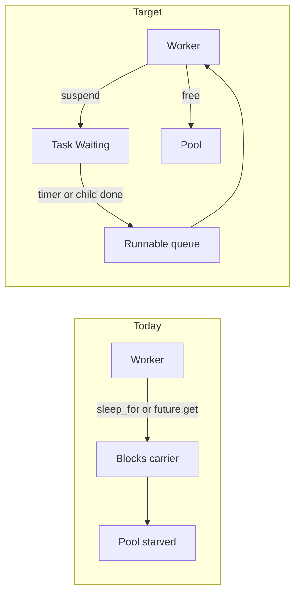

# Kotlin-style suspend/park for Ad (lang4)

## Goal

Make Ad concurrency **resemble Kotlin coroutines**:

- Every Ad-level wait is a **suspend point**: `delay`, `join`, `await`, and any later wait APIs.
- Suspend **parks the task** and **frees the worker** (carrier). No `sleep_for` / `future.get` on pool threads.
- Resume when the event fires: **timer** for `delay`, **child completion** for `join`/`await`.
- Nested `spawn` stays on the M:N pool (no overflow OS thread starvation workaround as the normal path).
- Success criteria:
  - [`tests/spawn_100k_sleep.ad`](tests/spawn_100k_sleep.ad): 100k × `delay(1000)` then join all ≈ **~1–2s** wall clock.
  - Nested `spawn` + `join` inside tasks does not pin workers for the child’s lifetime.
  - Existing `parallel_delay_*`, `async_await`, fairness/cancel tests keep correct results.

Mental model (Kotlin):

| Kotlin | Ad |
|--------|-----|
| `suspend` / continuation | task park + `run_slice` continuation |
| `delay` | park + timer wake |
| `await` / Deferred | park on `join` / `await` until task done |
| Dispatcher workers | `TaskScheduler` worker pool |
| `Thread.sleep` (avoid) | blocking only on **main/REPL** bridge, never on workers |

## Current gap



- [`builtin_delay`](src/builtins.cpp): `sleep_for` on whatever thread runs it.
- [`joinTaskValue`](src/builtins.cpp): `future.get()` blocks the caller (including workers).
- [`await`](src/evaluator.cpp) routes through the same join path.
- Yield in [`scheduler.cpp`](src/scheduler.cpp) re-enqueues immediately; no wait-until-event.
- Nested submit from a worker can start an **overflow pthread** ([`submitPreemptible`](src/scheduler.cpp)), unlike Kotlin’s dispatcher.
- [`spawn_100k_sleep.ad`](tests/spawn_100k_sleep.ad) does not wait for completion.

## Design

### 1. Unified suspend infrastructure

In [`object.h`](src/object.h) / [`scheduler.h`](src/scheduler.h):

- Add `TaskStatus::Waiting`.
- Extend `RunSliceResult`:
  - `Completed` | `Yielded` (quantum, optional) | **`Suspended`**
  - For `Suspended`: `continuation` that accepts an optional **resume `Value`** (null after `delay`, child result after `join`/`await`).
  - Wake kind: `DelayUntil(time_point)` **or** `UntilTask(shared_ptr<TaskObject>)`.
- Control transfer: throw or set a `SuspendRequest` when `tls_task_ctx` is set (Kotlin-like cooperative suspend). Outside task context, keep a **blocking bridge** for main/REPL only.

`TaskObject` gains a waiter list: tasks suspended on this handle, woken when the task finishes/fails/cancels.

### 2. Suspend points (all Ad waits)

Treat these like Kotlin suspend APIs:

| API | Park reason | Resume value |
|-----|-------------|--------------|
| `delay(ms)` | timer at `now+ms` | `null` |
| `join(t)` | until `t` terminal | `t`’s result (or rethrow failure) |
| `await expr` | same as join on the task value | same |
| future waits | same pattern | — |

Rules:

- **In task context:** never block the carrier; always `Suspended` + register wake source.
- **On main/REPL (no `tls_task_ctx`):** blocking `sleep_for` / `future.get` allowed so scripts like `join(spawn(...))` at top level still work without a nested event loop (Kotlin `runBlocking` analogue).

### 3. Statement/expression resume

Suspend must resume with a value mid-evaluation:

- Prefer **expression-level** suspend for `join`/`await`/`delay` used as expressions (`puts(join(t))`, `let x = await f()`).
- Implement by bubbling `SuspendRequest` through eval and capturing a continuation that:
  1. Injects the resume value as the result of the suspend call
  2. Continues the remaining block/expression
  3. Preserves env / `this`

Minimum viable: statement and simple expression forms used in current tests; expand if a test requires deeper expression positions.

### 4. Scheduler: timers + completion wakes

[`TaskScheduler`](src/scheduler.cpp):

- **Delay queue** (min-heap): `{wake_at, ScheduledTask}`; timer thread moves due tasks to the runnable queue.
- **Join waiters**: on `finishTask` / `failTask`, enqueue all waiters with the resume value/exception packed into their continuation.
- **Cancellation:** cancel removes from delay queue; waiters of a cancelled task fail accordingly; a waiting task that is itself cancelled is not resumed with success ([`parallel_delay_cancelled.ad`](tests/parallel_delay_cancelled.ad)).
- **Shutdown:** drain runnable + delay queues and wait for in-flight slices; do not abandon parked tasks.
- **Worker loop:**
  - `Completed` → finish
  - `Yielded` (quantum) → requeue immediately
  - `Suspended` → register with timer or waiter list only (never sleep)

### 5. Nested spawn without overflow threads

Kotlin does not start a new OS thread per nested `launch`. Change [`submitPreemptible`](src/scheduler.cpp):

- Always enqueue onto the shared pool when a scheduler exists, including from worker threads.
- Rely on park-on-join so a worker that spawned a child and `join`s it **releases** the carrier instead of needing an overflow thread to avoid deadlock/starvation.
- Keep overflow only as a last-resort escape hatch (or remove entirely once park-on-join is solid).

### 6. Benchmark and tests

[`tests/spawn_100k_sleep.ad`](tests/spawn_100k_sleep.ad):

```ad
let ts = [];
for (let i = 0; i < 100000; i = i + 1) {
    ts = push(ts, spawn(fn() { delay(1000); }));
}
for (let i = 0; i < 100000; i = i + 1) {
    join(ts[i]);
}
puts("done");
```

- Expect `/usr/bin/time -p` ≈ **1.x–2s** real (not hours).
- If O(n²) `push` dominates, add a mutating push / reserve builtin so the benchmark measures parking, not array copies.

Also verify:

- All `tests/parallel_delay_*.ad`
- [`tests/async_await.ad`](tests/async_await.ad)
- Nested spawn+join ([`tests/parallel_delay_nested_spawn.ad`](tests/parallel_delay_nested_spawn.ad)) under park-on-join
- Cancel paths still error as today

### 7. Explicit non-goals (still not Java VT)

- Automatic parking of **arbitrary C++** blocking (raw mutex, future native I/O) without an Ad suspend API—Kotlin also does not magically park `Thread.sleep`.
- New language syntax beyond existing `delay` / `join` / `await` / `spawn` / `async`.
- Full structured-concurrency hierarchy (Kotlin `coroutineScope` cancel-children) unless needed for cancel tests; wire cancel to waiters as required by existing tests.

## Files to touch

| File | Change |
|------|--------|
| [`src/object.h`](src/object.h) / [`object.cpp`](src/object.cpp) | `Waiting`; waiter list on `TaskObject` |
| [`src/scheduler.h`](src/scheduler.h) / [`scheduler.cpp`](src/scheduler.cpp) | delay queue, timer, wake-on-complete, no carrier block, nested enqueue |
| [`src/evaluator.cpp`](src/evaluator.cpp) / [`evaluator.h`](src/evaluator.h) | suspend points for delay/join/await; continuations with resume value |
| [`src/builtins.cpp`](src/builtins.cpp) | park vs blocking bridge for `delay`/`join` |
| [`tests/spawn_100k_sleep.ad`](tests/spawn_100k_sleep.ad) | spawn + join all |
| Delay/async/nested tests | confirm under new semantics |

## Implementation order

1. **Suspend infra** — status, `Suspended` result, continuation-with-value, waiter list hooks.
2. **Park `delay`** — timer queue + resume with `null`; worker never sleeps.
3. **Park `join`/`await`** — register waiter; wake on finish/fail/cancel; resume with result.
4. **Nested spawn** — enqueue-only from workers; remove normal overflow path.
5. **Top-level bridge** — main/REPL may still block on join/delay.
6. **Tests + 100k benchmark** — ~1s sleep test; full delay/async/nested regression.

## Done when

- Workers never call `sleep_for` or `future.get` while running Ad tasks.
- 100k concurrent delays ≈ 1s wall clock with joins.
- `join`/`await` inside tasks park like Kotlin `await`.
- Nested spawn+join does not require overflow threads for correctness.
